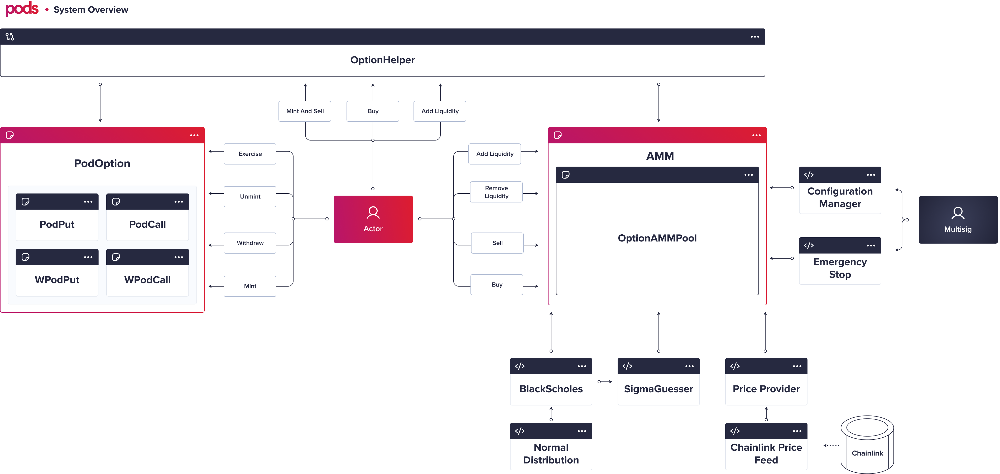

# System Overview

## Main Components

### [Option Instrument](../options-protocol-overview/options-smartcontracts/)

This is the part of the system responsible for managing the option itself, where you could mint, exercise, and withdraw basically. You can see it in-depth [here](../options-protocol-overview/options-smartcontracts/).

### [Option AMM](../options-amm-overview/options-amm-sm/)

We have our special model, an AMM designed specifically for options. If you want to check why do we need that, check [here](../options-amm-overview/introduction.md#why-the-current-model-doesnt-fit)! You can see it in-depth [here](../options-amm-overview/options-amm-sm/).

### Option Helper

It's our connector. Although you can interact directly with the system, you can use this contract in order to reduce gas costs, batching transactions, also reducing multiple "allowances". 

