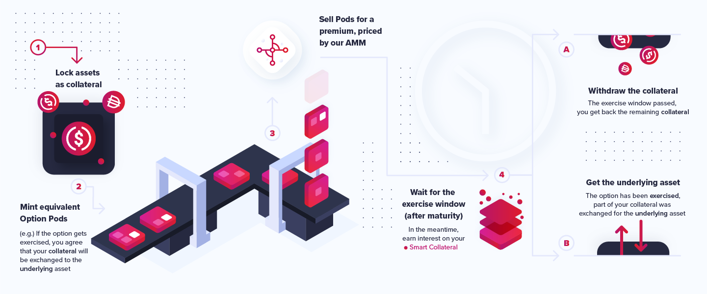
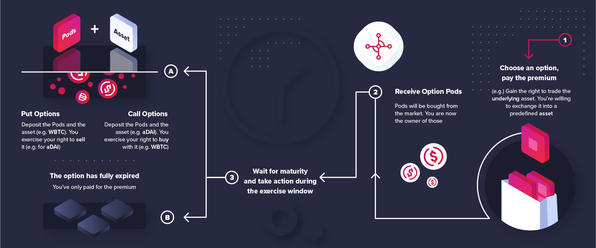
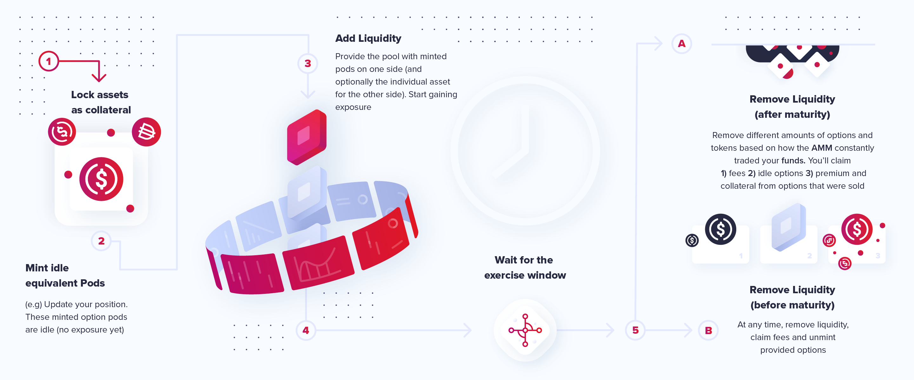

# Brand Assets

## Logo

The main version of the logo, together with some variations of shape and color. Available in multiple sizes and formats \(`svg`, `png`\). 

📦 Preview the latest version on Google Drive [here](https://drive.google.com/drive/folders/1J_yHuhw1G9t1izzt7O5ybIGWVfFGFTgh?usp=sharing).

## Covers

For usage on social media, we provide some cover suggestions. Zoom background included. 

📦 Preview the latest version on Google Drive [here](https://drive.google.com/drive/folders/1ZemWz1abmBQgHXHh3pQnHab0ZUknzQOf?usp=sharing).

## Elements

For various other graphic compositions, we release our "elements kit". It contains graphics related to our "pods factory", "smart collateral" and other abstract elements. 

📦 Preview the latest version on Google Drive [here](https://drive.google.com/drive/folders/1sSx28bDUgd8JZA8W5NkG1wz-LfLLHu12?usp=sharing).

## Diagrams

To explain the journey of a pod option through our system, we release a series of diagrams and sketches explaining the most important steps. 

📦 Preview the latest version on Google Drive [here](https://drive.google.com/drive/folders/11w1Ru_e7G60HuCrKrdWPaG9JqEmAEnZS?usp=sharing). 

You can find a mobile-friendly version inside the kit. The diagrams will showcase the flow for buyer, seller and minter for both puts and calls. There will also be a general flow \(the one uploaded above\). 

## Platform Kit

Platform screenshots coming soon. Contact us at contact@pods.finance for any custom content you might need.

## Color Kit

Colors we use for the logo and other digital-first elements.

| Color | Value |
| :--- | :--- |
| Primary | **`#B7156B`** |
| Secondary | **`#DF1D2C`** |
| Gradient | **`#B7156B -> #DF1D2C`** at **`45°`** |
| Middle | **`#C41857`** |
| Dark | **`#262940`** |

