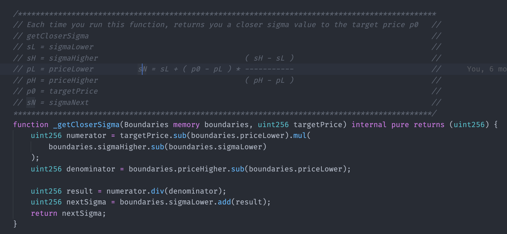

# Find The Next Sigma

### Numerical Methods

This part of our system is responsible for finding the new sigma \(IV\) based on the new option target price. It uses a numerical method to do that.

Numerical methods are a mathematical way to solve certain problems. They allow us to approximately solve math problems, specifically ones we can not solve analytically \(or at least, not easily\).

In our case, the Black Scholes formula is one example of an equation that is easy to solve analytically when looking for the option price, but it is very hard when you already have the option price and want to find one of the variables missing that resulted in this price. In our case, that variable is the sigma\(IV\).  

### Our Numerical Method

The numeric method that we use in our case is the one proposed by Yan Wang in his paper called [A Well-Posed Algorithm to Recover Implied Volatility](https://www.semanticscholar.org/paper/A-Well-Posed-Algorithm-to-Recover-Implied-Wang/ed2f3b452c3734f9ea766ad0210063c116eb580f).

For those familiar with search algorithms, this method resembles a [Binary Search](https://en.wikipedia.org/wiki/Binary_search_algorithm#:~:text=In%20computer%20science%2C%20binary%20search,middle%20element%20of%20the%20array.), where you should first define upper and bottom boundaries. After that, your next guess will be something between those boundaries. If you have not found the target result inside this loop, the result found becomes one of the boundaries and then we repeat the process.

Below we are going to show the steps used in this algorithm to find the new sigma. 

#### a\) Defining the boundaries

We will need to define the upper and bottom boundaries for the sigma $$\sigma$$and his respective option price. We will call these variables $$\sigma_{higher}$$, $$\sigma_{lower}$$, $$price_{higher}$$and $$price_{lower}$$.

That is no magic trick to define the initial boundaries. You can guess a very high sigma, calculate the Black Scholes equation using this sigma, and then check if the price is higher. If the price that you found is higher, then that price became your initial upper boundary.  To find the bottom boundary, repeat the same process with a very low sigma.

#### b\) Find the next sigma

In order to find the next result. We will use this equation:

#### $$\displaystyle \sigma_{next}=\sigma_{lower}+\frac{(price_{target}-price_{lower}) *(\sigma_{higher} - \sigma_{lower} )}{price_{higher}-price_{lower}}$$

#### c\) Run Black Scholes and compare results

Now that we have found our `nextSigma` $$\sigma_{next}$$, we can re-calculate the Black Scholes and check if the calculated price is equal enough to the target price. In our case, we define that we accept 1% difference tolerance, this means that if the calculated price matches the target price within a 1% range, we accept them as "equal".

#### d\) Repeat if needed 

If the calculated price differs more than 1% compared to the target price. We need to repeat the process, redefining the new boundaries. That is quite straightforward. If the calculated price is below the target price, then the calculated price \(and the respective sigma\) became the lower boundary. If not, the calculated price became the upper boundary.

### How to avoid high gas costs

In environments such as Ethereum, you need to aim for efficient algorithms, otherwise, you will end up paying a lot to run a transaction. 

The way that we solved that problem when running our numerical method is the `sigmaInitialGuess.` Before executing the transaction. you can perform a `call()` method with the trade that you will want to execute. 

Since `call()`methods are free, we run this numeric method and return the `nextIV` to the caller. Then, when he is going to perform the real trade, he can pass the  `sigmaInitialGuess` parameter that will be used as one of the initial boundaries or even be the right answer before even running this process.

