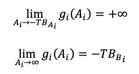

# Functions

## Main Functions

The following properties have to be defined to create a new pool:

* TokenA
  * In the case of the optionAMM tokenA will always be the option token.
* TokenB
  * In the case of the optionAMM tokenA will always be the stable token.
* $$IV_0$$
  * The initial IV of the pool

Once a pool was created, the following can happen in a given instant $$i$$:

$$E_i $$$$∈ $$ {$${A, RA, T, R}$$ }

In a nutshell, the events can be translated to:

* **Add Liquidity** \($$A$$\) Users can provide one side or both sides of assets as liquidity to a pool to earn fees.
* **Re-add Liquidity** \($$RA$$\)

  Users who had provided liquidity before can add liquidity again with no impact on their previous added funds. 

* **Trade** \($$T$$\) Users can buy or sell assets to the pool paying a fee.
* **Remove Liquidity** \($$R$$\) Users that previously added funds to the pool can withdraw liquidity.

  
A price has to be calculated for the option within the pool for a trade to happen.

The pricing formula below simplifies the actual pricing model and explains how the AMM updates the option premium on a particular instant. For more details, see [Pricing](https://app.gitbook.com/@pods-finance-1/s/teste/~/drafts/-MN6HaWpBmzbOVxj8TTa/options-amm-overview/optionamm/pricing). 

$$P_i$$, the opening price \(price when the event starts to happen\), is defined as a function $$f_p$$. This function uses an external vector of $$MarketData$$ \(currently leveraging Chainlink with their spot price update feed\) and an internal vector $$IV$$\(Implied Volatility\) in our implementation of Black Scholes.  

The price is defined as the **quantity of token B** needs to buy **one token A** at a given time $$i$$ .

$$P_i=f_p(IV_{i-1},MarketData_i)$$ 

Considering $$A_i $$ and $$B_i$$ the amounts of token A and token B, respectively that will be sent or received by the contract in the case of trade.

Consider the number of tokens sent \(or received by the pool\) during a trade as the product a $$g_i$$function. The $$g_i$$ function considers the price and the impact the trade has on the pool. The positive sign, in this context, means the pool is receiving tokens.

$$B_i=g_i(A_i)$$ 

The $$g_i$$ function can be found in more detail in the Trade section. For simplicity, here we'll only state its properties as follows:

$$B_=g_i(A_i)≥-P_i\cdot A_i$$ 

$$g_i (x)≤g_i (y) $$ if $$ x>y$$ 

The price calculated by the AMM will impact the pool, and after the trade, it will save the new IV of that moment. This factor will be used in the next trade as input \($$IV_{i-1}$$\) to the next trade pricing formula. The new IV \($$IV_i$$\)will be guessed by the contract and should guarantee the following:

$$\displaystyle f_p(IV_i,MarketData_i)=\frac{-B_i}{A_i}$$

 Check [Trade](https://app.gitbook.com/@pods-finance-1/s/teste/~/drafts/-MN6HaWpBmzbOVxj8TTa/options-amm-overview/optionamm/functions/trade) function to understand the steps of how information is updated.


Now that you know the functions let's learn about them in more detail.


