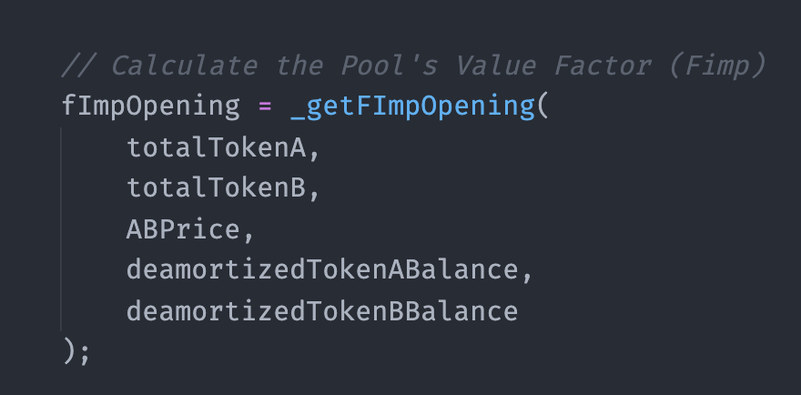

# Add Liquidity

## Add Liquidity

The event of adding liquidity requires the following information from the user:  
1. $$A_{du}$$ Amount of token A to be added  
2. $$B_{du}$$ Amount of token B to be added  
3. Owner

 After the information was supplied, the `add liquidity` function will perform the following activities:

### 1. Calculate factors

### 1.1 Calculate Option Price 

This happens if $$i≠0$$. If $$i=0$$ , it is not required to calculate the option price in the very first liquidity provision in a pool. 

For simplicity, let's acknowledge that the option price is a function that required a $${MarketData}$$ and an internal vector \($$IV$$\) as input.

$$P_i=f_p({IV_{i-1}},{MarketData_i})$$ 

For more details about the pricing formula or its contract implementation for pricing the options, check [this section](https://app.gitbook.com/@pods-finance-1/s/teste/~/drafts/-MNH5EfMIG3zYkpvevUc/options-amm-overview/optionamm/pricing). 

### 1.2 Calculate the Pool's Value Factor \($$F_{v_{i}}$$\) 

If $$i=0$$ , $$F_{v_{i}}=1$$ 

If $$i≠0$$ , $$\displaystyle F_{v_{i}}= \frac{TB_{A_{i-1}}\cdot P_i+TB_{B_{i-1}}}{DB_{A_{i-1}} \cdot P_i+DB_{B_{i-1}}}$$ 

Since this is the first liquidity provision of the pool, this is $$i=0$$ and therefore, $$F_{v_{i}}=1$$.

### 2. Updates

### 2.1 Update Deamortized Balance of the pool for each token

By the time the pool is created \($$i=0$$\) , the $$DB_{A_i}$$and $$DB_{B_i}$$ will be equal to the $$A_{du}$$ and $$B_{du}$$ since:

 $$F_{v_{i}} = 1$$  
$$\displaystyle DB_{A_{i-1}}=0$$  
$$\displaystyle DB_{B_{i-1}}=0$$

$$\displaystyle DB_{A_{i}}=DB_{A_{i-1}} +\frac{A_{du}}{F_{v_{i}}}$$

$$\displaystyle DB_{B_{i}}=DB_{B_{i-1}} +\frac{B_{du}}{F_{v_{i}}}$$

### 2.2 Update the User Balances for each token and the Pool Factor previously calculated

Updating this factor is essential, especially when there is a `re-add liquidity` event. 

$$UB_{A_{u}}=A_{du}$$ 

$$UB_{B_{u}}=B_{du}$$

The $$UB_{f_{u}}$$ works as if it was a snapshot of the pool's factor at the moment of this user's deposit. This factor will be updated in the case of `re-add liquidity` by the user. 

$$UB_{F_{u}}=F{v_{du}}$$ 

### 2.3 Update Total Balance of the pool for each token

$$TB_{A_{i}}=TB_{A_{i-1}} +A_{du}$$ 

$$TB_{B_{i}}=TB_{B_{i-1}} +B_{du}$$ 


At the contract level, an ERC20 transfer is happening. Total balance \(TB\) is just a mathematical representation. The Total balance is checked by consulting the `balanceOf()` of the pool contract of the respective token \(tokenA or tokenB\)



Add liquidity ✅


