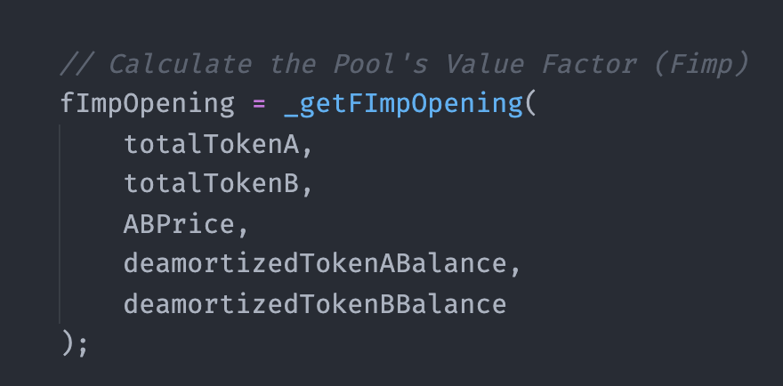
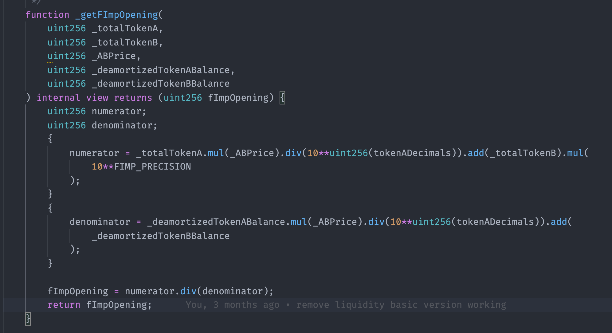
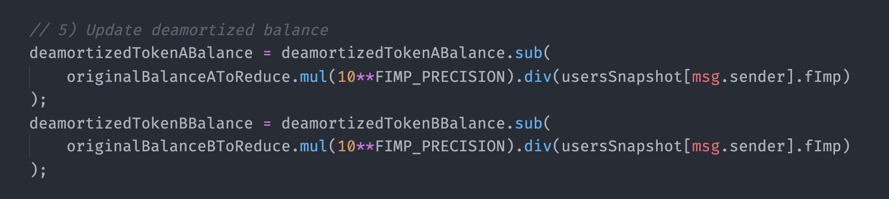
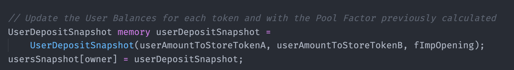
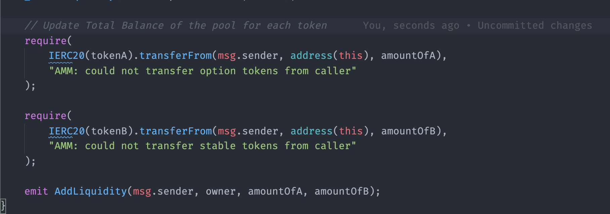

# Re-add Liquidity

## Re-add Liquidity

This event can only happen for users that provided liquidity before. The event of re-adding liquidity requires the following information from the user:  
1. $$A_{du}$$ Amount of token A to be added  
2. $$B_{du}$$ Amount of token B to be added  
3. Owner

After the information was supplied, the `re-add liquidity` function will perform the following activities:

### 1. Calculate factors

### 1.1 Calculate Option Price

For simplicity, let's acknowledge that the option price is a function that required a $$MarketData$$ and an internal vector \($$IV$$\) as input.

$$P_i=f_p(IV_{i-1},MarketData_i)$$

For more details about the pricing formula or its contract implementation, check [this section](https://app.gitbook.com/@pods-finance-1/s/teste/~/drafts/-MNH5EfMIG3zYkpvevUc/options-amm-overview/optionamm/pricing). .

### 1.2 Calculate the Pool's Value Factor \($$F_{v_{i}}$$\)

Since the re-add liquidity happens in a given moment$$i≠0$$, $$F_{v_{i}}$$may not be equal to 1, so there should be a $$F_{v_{i}}$$calculation. The following formula will trigger the calculation:

$$\displaystyle F_{v_{i}}= \frac{TB_{A_{i-1}}\cdot P_i+TB_{B_{i-1}}}{DB_{A_{i-1}} \cdot P_i+DB_{B_{i-1}}}$$

### 2. Updates

### 2.1 Update Deamortized Balance of the pool for each token

In this step, the AMM saves how much it owes the user at the current Pool Value Factor "expense."

$$\displaystyle DB_{A_{i}}=DB_{A_{i-1}} +\frac{A_{du}}{F_{v_{i}}}$$

$$\displaystyle DB_{B_{i}}=DB_{B_{i-1}} +\frac{B_{du}}{F_{v_{i}}}$$

### 2.2 Update the User Balances for each token and the Pool Factor previously calculated

Updating this factor represents combining both deposits considering the time each entered the pool. $$\displaystyle UB_{A_{u}}=UB_{A_{u_{i-1}}}\cdot \frac {F_{v_{i}}}{UB_{F_{u}}}+A_{du}$$

$$\displaystyle UB_{B_{u}}=UB_{B_{u_{i-1}}}\cdot \frac {F_{v_{i}}}{UB_{F_{u}}}+B_{du}$$

The $$UB_{f_{u}}$$ works as if it was a picture of the pool's factor at the moment of this user's deposit. This factor will be updated again whenever there is a `re-add liquidity` event by the same user.

$$UB_{F_{u}}=Fv_i$$

### 2.3 Update Total Balance of the pool for each token

$$TB_{A_{i}}=TB_{A_{i-1}} +A_{du}$$

$$TB_{B_{i}}=TB_{B_{i-1}} +B_{du}$$


At the contract level, an ERC20 transfer is happening. Total balance \(TB\) is just a mathematical representation. The Total balance is checked by consulting the`balanceOf()` of the pool contract of the respective token \(tokenA or tokenB\)



Re-add liquidity ✅


