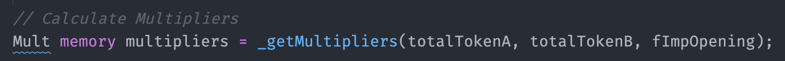

# Remove Liquidity

**Single-sided liquidity provision**  
_Quick recap:_ it is possible to add liquidity on one side of the pool. The pool will track the user's initial exposure, and by the time the user removes liquidity, the withdrawal position will reflect the initial exposure within a new distribution of assets. It means that it is possible \(and likely\) to withdraw percentages of both assets.

The remove liquidity function allows users to choose what percentage of the amount provided they wish to withdraw at a given instant $$i$$ . The only user who can remove liquidity is a user who provided liquidity before and still has funds in the pool. $$r$$ is the proportion of the user's initial deposit that it wishes to withdraw now. Removing "1" corresponds to remove 100% of the funds previously added.

~~~~$$r_A≤1$$ and $$r_B≤ 1$$

The event of removing liquidity requires the following information:  
1. $$r_A$$Proportion of initial exposure of token A that wants to withdraw.  
2. $$r_B$$ Proportion of initial exposure of token B that wants to withdraw.

## 1. Calculate factors

## 1.1 Calculate Option Price

For simplicity, let's acknowledge that the option price is a function that required a $$MarketData$$ and an internal vector \($$IV$$\) as input.

$$P_i=f_p(IV_{i-1},MarketData_i)$$

For more details about the pricing formula and its contract implementation, check [this section](https://app.gitbook.com/@pods-finance-1/s/teste/~/drafts/-MNH5EfMIG3zYkpvevUc/options-amm-overview/optionamm/pricing).

## 1.2 Calculate the Pool's Value Factor \($$F_{v_i}$$\)

$$\displaystyle Fv_i= \frac{TB_{A_{i-1}}\cdot P_i+TB_{B_{i-1}}}{DB_{A_{i-1}} \cdot P_i+DB_{B_{i-1}}}$$

The pool's opening factor works as a factor that will update the pool's amortization as time passes.

## 1.3 Calculate multipliers

The redemption multipliers are defined as:

$$\displaystyle mAA_i= \frac{min(Fv_i\cdot DB_{A_{i-1}};TB_{A_{i-1}})}{DB_{A_{i-1}}}$$

$$\displaystyle mBB_i= \frac{min(Fv_i\cdot DB_{B_{i-1}};TB_{B_{i-1}})}{DB_{B_{i-1}}}$$

$$\displaystyle mAB_i= \frac{TB_{B_{i-1}}-mBB_i\cdot DB_{B_{i-1}}}{DB_{A_{i-1}}}$$

$$\displaystyle mBA_i= \frac{TB_{A_{i-1}}-mAA_i\cdot DB_{A_{i-1}}}{DB_{B_{i-1}}}$$

## 1.4 Calculate withdrawal amount of each token

$$\displaystyle A_i=-[mAA_i\cdot r_A\cdot \frac{UB_{A_{u}}}{F_{v_{du}}}+mBA_i\cdot r_B\cdot \frac {UB_{B_{u}}}{F_{v_{du}}}]$$

$$\displaystyle B_i=-[mBB_i\cdot r_B\cdot \frac{UB_{B_{u}}}{F_{v_{du}}} + mAB_i \cdot r_A\cdot \frac {UB_{A_{u}}}{F_{v_{du}}}]$$

## 1.5 Update new user balance for each token

After the withdraw, the contract calculates the updated user balance for each token.

$$UB_{A_u}=UB_{A_{u_{i-1}}}\cdot (1-r_A)$$

$$UB_{B_u}=UB_{B_{u_{i-1}}}\cdot (1-r_B)$$

## 1.6 Update new deamortized balance for each token

$$\displaystyle DB_{A_i}=DB_{A_{i-1}}-r_A\cdot \frac{UB_{A_{u_{i-1}}}}{F_{v_{du}}}$$

$$\displaystyle DB_{B_i}=DB_{B_{i-1}}-r_B\cdot \frac{UB_{B_{u_{i-1}}}}{F_{v_{du}}}$$

## 1.7 Update new pool balance for each token

The contract will calculate the new total balance for each token considering the recent withdrawal.

$$TB_{A_{i}}=TB_{A_{i-1}}+A_i$$

$$TB_{B_i}=TB_{B_{i-1}}+B_i$$


At the contract level, an ERC20 transfer is happening. Total balance \(TB\) is just a mathematical representation. The Total balance is checked by consulting the `balanceOf()` of the pool contract of the respective token \(tokenA or tokenB\)



Remove Liquidity ✅


