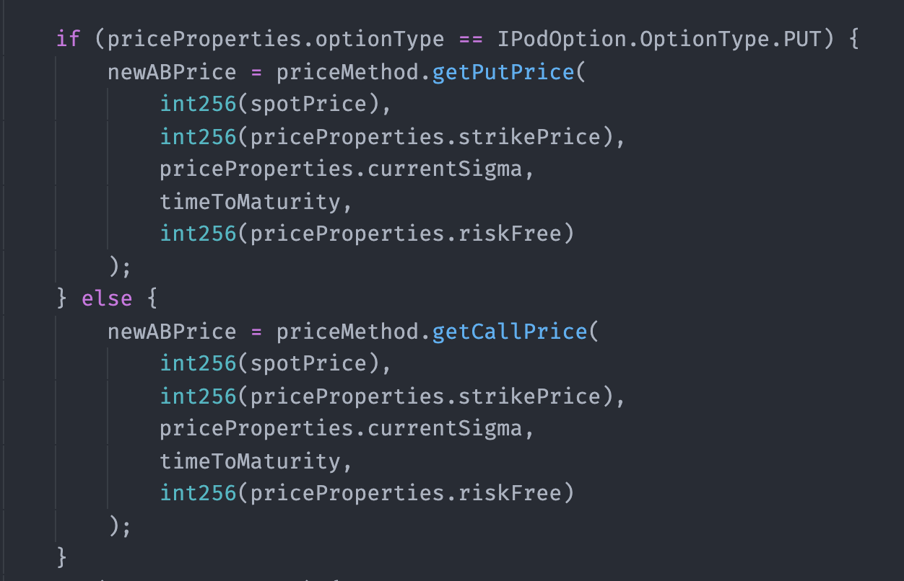
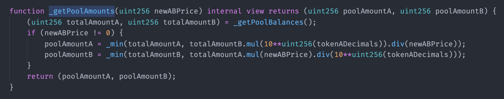
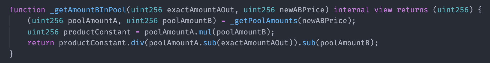
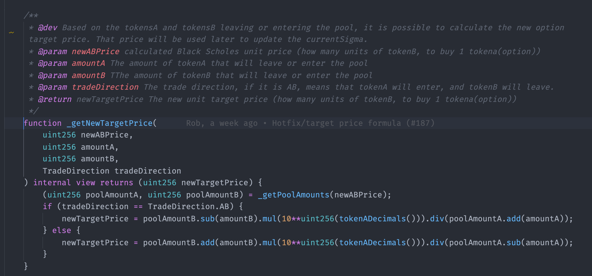
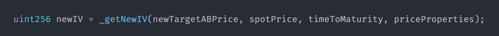
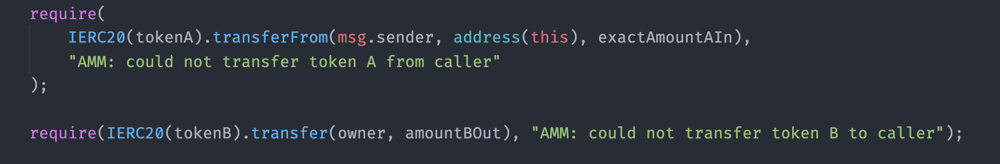

# Trade

When, in a given instant $$i$$, a trade is initiated and the contract will check the following parameters to proceed:

* Trade direction \(from token A to token B or the opposite\).
* The number of tokens the user wants to buy or sell \( `exactAInput` or`exactBoutput` \). The amounts considered in the trade will be called $$A_i$$ and $$B_i$$ , and they will be represented with the sign of the trade from the pool's point of view. If purchases options tokens, $$A_i$$ will be negative \(options tokens are leaving the pool\), and $$B_i$$will be positive \(stablecoins are entering the pool\).
* The total price slippage the user allows.
* Owner.

Once the contract gathered this information, it will start performing the following trade functions:

### 1. Calculate factors

### 1.1 Calculate Option Unit Theoretical Price

The contract will supply our BS implementation with the following data:

* the current spot price of the underlying asset
* time to maturity
* strike price
* risk-free rate
* last sigma \($$IV_{i-1}$$\)

And will get in return the updated option price \($$P_i)$$ based on the current market scenario.

### 1.2 Calculate total price based on the transaction amount

#### a\) Calculate pool amounts for each token:

$$\displaystyle poolAmountA = \min\left\{TB_{A};\frac{TB_{B}}{P_i}\right\}$$ 

$$\displaystyle poolAmountB = \min\left\{TB_{A};{TB_{A}}\cdot {P_i}\right\}$$ 

#### b\) Calculate product constant

$$k=poolAmountA*poolAmountB$$ 

#### c\) Calculate total transaction price, in terms of B

#### $$\displaystyle B_i=\frac{k}{(poolAmountA-tradeAmountA)}-poolAmountB$$ 

#### d\) Calculate new option unit price \(aka target price\)

The target price will be the input for the SigmaGuesser contract.

#### $$\displaystyle TargetPrice_i=\frac{poolAmountB-B_i}{poolAmountA+A_i}$$

This part of our system is responsible for finding the new sigma \(IV\) based on the new option target price. It uses a numerical method to do that. If you want to deep dive into how it works, check the section Sigma Guesser.


Note that on the contract level, for each of our 4 trade functions \(`exactAInput / exactAOutput / exactBInput / exactBOutput`\) the functions above are slightly different.


### 3. Calculate new sigma based on the new unit price

This part of our system is responsible for finding the new sigma \(IV\) based on the new option target price. It uses a numerical method to do that. If you want to deep dive into this topic, you can check our Find the next sigma section.

### 4. Updates

### 4.1 Update Total Balances

This step will update the pool's new total balances, considering the trade that just happened. 

$$TB_{A_{i}}=TB_{A_{i-1}} +A_i$$ 

$$TB_{B_{i}}=TB_{B_{i-1}} +B_i$$ 


At the contract level,  $$A_{i}$$ are usually `exactAmountIIn or exactAmountAOut and` $$B_{i}$$ is `amountBIn / amountBOut` since we do not handle negatives numbers on solidity.


> Note that the trade function won't update the $$DB$$ nor the $$Fv$$ factor.


Trade ✅


