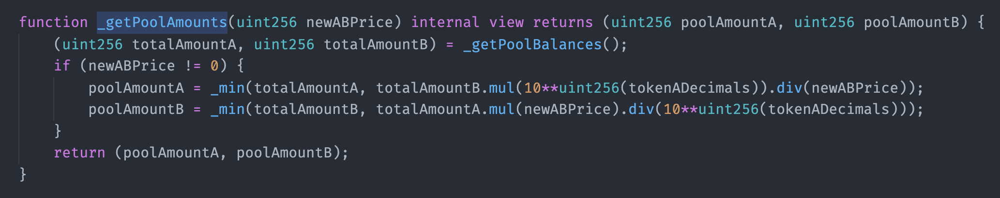
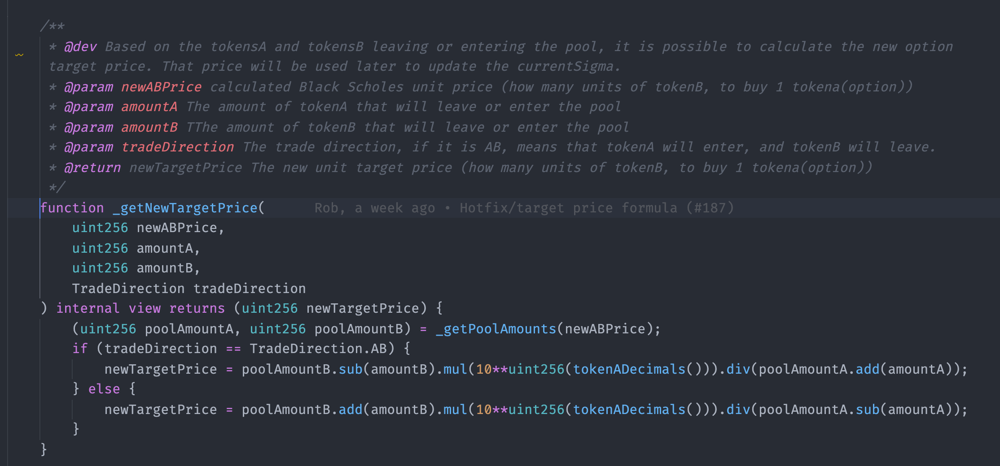

# Pricing

## Black Scholes

There are multiple models for options pricing. The most widely used model is called [Black Scholes](https://www.investopedia.com/terms/b/blackscholes.asp). It calculates European options' theoretical value using the current underlying asset price, option's strike price, expected risk-free interest rate, time to expiration, and expected volatility. 

Although the Options Instrument allows American options series to be created, it is not recommended to implement them using the AMM current pricing model. Bear in mind that the options are represented in ERC20 tokens and can be sold anywhere \(not necessarily in the options AMM\) so one can still put together an American option and use it elsewhere.

### Assumptions

The AMM's implementation of the model makes certain assumptions:

* European Options \(exercised only during the expiration window\)
* No dividends are paid out during the option lifetime
* Markets are efficient \(moves cannot be predicted, and arbitrage opportunities will be taken instantly\)
* The risk-free rate is accounted as 0% at this point
* Changes in supply and demand for tokens reflected in the pool are expressed as changes to the implied volatility in the model for future pricing.

An option price translates the exercise's possibility based on probability and market sentiment towards the amplitude of change the underlying asset can have. The model describes what should be the correct price of an option today that expresses the correct probability of this event happening in the future so that, if the option is correctly price, there is no space for arbitrage.

The model assumes the underlying asset follows a [lognormal](https://www.investopedia.com/articles/investing/102014/lognormal-and-normal-distribution.asp) distribution since asset prices cannot be negative \(they are bounded by zero\). The lognormal distribution is asymmetrical and creates a right-skewed curve. The [skewness](https://www.investopedia.com/terms/s/skewness.asp) represents the degree of distortion from the symmetrical bell curve in a probability distribution. Data on both sides of the skew are also referred to as "tail."

The Black Scholes model allows for discovering a new price based on current and past values. 

### Original Formula

The put option pricing formula is calculated as follows:

$$c$$ = Call option price

$$p$$ = Put option price

$$S$$= Current Underlying Asset Spot Price

$$K$$ = Option's Strike price

$$r$$ = Risk-Free Rate

$$t$$ = Time to Maturity

$$N$$ = A normal distribution

The factor   discounts the strike price to present value at a risk-free rate. In our implementation, the risk-free rate is 0%, and for this reason the factor $$e^r=1$$. This means that we are not impacting the time value of the money into the strike price. The understanding that drives this decision is that there is no consensus on a risk-free rate for DeFi at this point.

The factor  calculates the probability that the underlying asset will be at or above the strike price by expiration.

The factor  calculates the future underlying asset price if the asset is above the strike by expiration.

## Parameters

### Initial IV

To create a pool, the creator has to define the initial price of the pool. The user is also defining the implied volatility of the pool opening moment \($$IV_i$$\). 

One could think of the IV as a factor that is guessed by the contract to fulfill the following: 

Applying the implemented formula, what IV generates this option price \(the initial price defined by the option creator\), considering the current market conditions? 


The contracts accept the first IV that generates a price range of {-0.1;+0.1} to avoid infinite calculations.


Once this initial IV is guessed, the contract will store this as the pool's initial level in terms of supply and demand.

### **Internal Oracle for Implied Volatility**

The creator of the option also defines the internal IV oracle. At this point, this is a stable \(and updatable\) number that will be used to smooth the IV fluctuations with trading activity and provide a more accurate price for users. 

The oracle will feed the calculation of a Weighted Average IV, together with the IV generated by the trading activity according to the formula:

$$
\displaystyle WeightedIV=\frac{(3*oracleIV + IV_i)}{4}
$$

## AMM's Price Discovery

### Logic Overview

The trading activity major outputs for the AMM are the pool imbalance and the new price. As we mentioned before, options prices rely on many factors and the premium alone is not representative from one period to the other. The important information on an options trading activity is the **resulting implied volatility.** 

If traders sell a significant amount of options at a certain level this translates into a decrease in the volatility for that option series. The opposite is also true. If traders buy a significant amount of options for a specific option series the implied volatility will rise. 

Whenever a trade is initiated, Pods AMM will calculate the current theoretical Black Scholes price considering the updated external information \(like spot price and time to maturity\) and use this information to quote the total cost of the operation. After quoting the total cost of the operation, the AMM has a new pool condition, an imbalance. This translates into a "new virtual unit price". According to Black Scholes, this virtual price has a corresponding implied volatility. Then, Pods AMM will find and store that implied volatility so it can pass this market information along to the next period. 

### Detailed Pricing

Within a trade, the price update has five phases:   
1. Checks  
2. Calculating the theoretical Black Scholes price,  
3. Calculating the total cost of the trade, considering a product constant formula,  
4. Calculating the new virtual price in the AMM right after the trade,  
5. Guessing the implied volatility that corresponds to the new virtual price.

### 1. Checks

In a given instant $$i$$ a trade can be initiated, the contract will check the following parameters to proceed:

* Trade direction \(from token A to token B or the opposite\)
* How many tokens A will deliver \(or how many tokens B wants to receive\) `exactAInput` `exactBoutput`
* What total slippage accepted
* Owner

### 2. Calculating Black Scholes Theoretical price

#### a\) Update underlying asset spot price

We're leveraging Chainlink to update the underlying asset spot price.   

#### b\) Calculate new time to maturity

The contract will calculate how long it will take until the expiration date. 

#### c\) Check latest sigma \($$IV_{i-1}$$\) or Updated Weighted Average IV

The previous \(or initial\) calculated price saved an $$IV_i$$ factor of that time. This IV factor now is $$IV_{i-1}$$since a period has passed. This IV will be used in the Weighted Average IV calculation and the result of the weighted average will calculate the new option theoretical Black Scholes price. 

#### d\) Input strike price

Check the options parameter and use it as an input.

#### e\) Input risk-free rate

As mentioned above, the risk-free rate is fixed at 0% at this point.

The contract will gather this information to feed the Black Scholes contract. This will result in a theoretical Blach Scholes price for the option at that time.

The next steps will apply the theoretical Black Scholes price \(also referred to as `ABprice` in the contracts\) to the pool conditions to quote the trade cost.  

### 3. Applying trade amount to constant product

Calculate the total cost for the trade considering the theoretical Black Scholes price.

#### a\) Calculate pool amounts for each token:

$$\displaystyle poolAmountA = \min\left\{TB_{A};\frac{TB_{B}}{P_i}\right\}$$ 

$$\displaystyle poolAmountB = \min\left\{TB_{B};{TB_{A}}\cdot {P_i}\right\}$$ 

#### b\) Calculate product constant

$$k=poolAmountA*poolAmountB$$ 

#### c\) Calculate total transaction price, in terms of B

#### $$\displaystyle B_i=\frac{k}{(poolAmountA-tradeAmountA)}-poolAmountB$$ 

### 4. Calculate new virtual price

Calculating the new virtual price \(aka target price\) based on the inventory imbalance after the trade. 

#### $$\displaystyle TargetPrice_i=\frac{poolAmountB-B_i}{poolAmountA+A_i}$$

The target price will be the input for the SigmaGuesser contract.


Note that on the contract level, for each of our 4 trade functions \(`exactAInput / exactAOutput / exactBInput / exactBOutput`\) the functions above are slightly different.


### 5. Guess the new IV \($$IV_i$$\) and store it in the contract for the next trade

At this point, the pool's inventory changed, and it represents a new "virtual price." The IV corresponding to this new virtual price reflects market information of supply and demand for this option. 

### 4. Guess new IV \($$IV_i$$\) and store it in the contract for the next trade.

After the trade, the pool's inventory changed, and it represents a new "virtual price." This price is used to guess the new IV after the trade. In the next trade, the IV calculated now will be used to calculate a new price then. If you want to deep dive into this topic, check our Find next IV section.
So the AMM will input the new target price in the Black Scholes formula and find the new correspondent IV for this price. It uses a specific numerical method applied to Black Scholes. If you want to deep dive into how it works, explore [Find next IV.](https://app.gitbook.com/@pods-finance-1/s/pods_v1/~/drafts/-MakphibKovdOtH2XjQ4/options-amm-overview/optionamm/find-the-next-sigma)

The IV found will be stored in the contracts to later feed the Weighted Average with 25% weight.

### Pricing Flow

See below a diagram that explains the pricing flow when there is a trade happening. 



