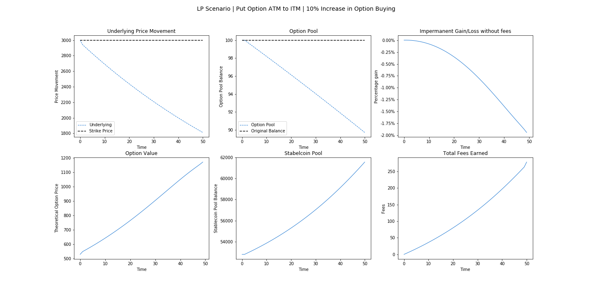
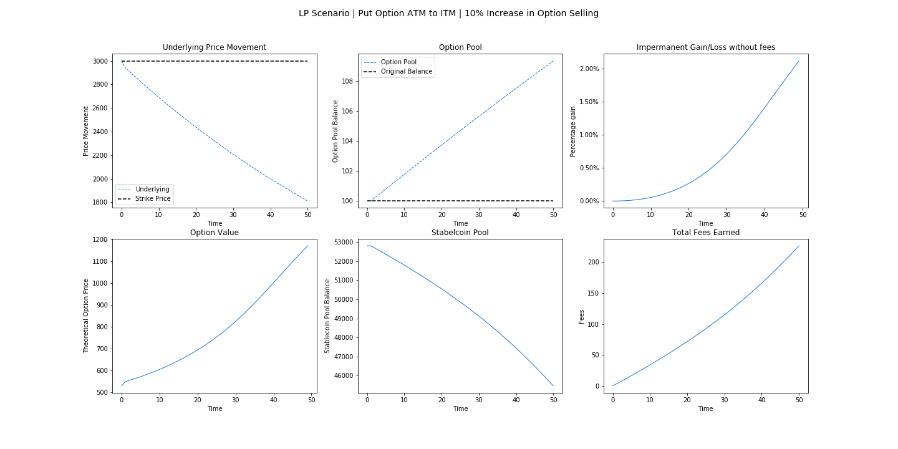
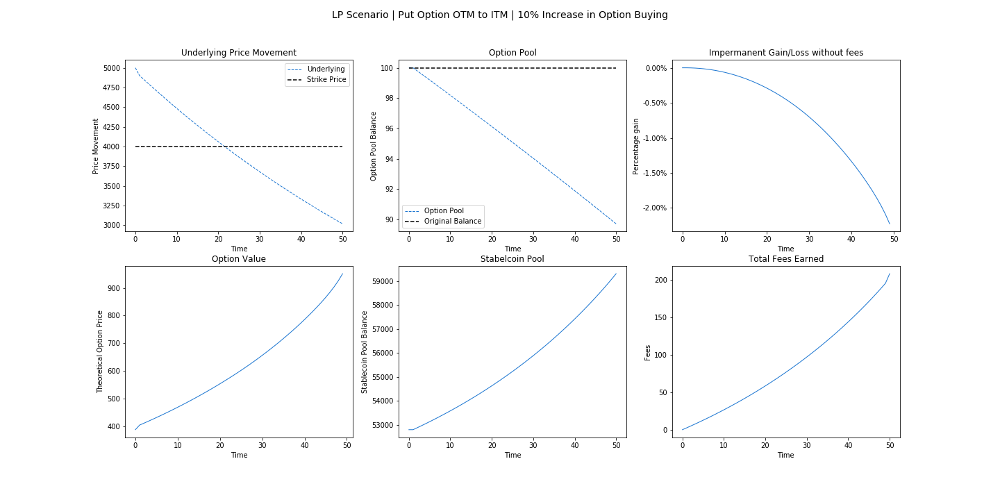
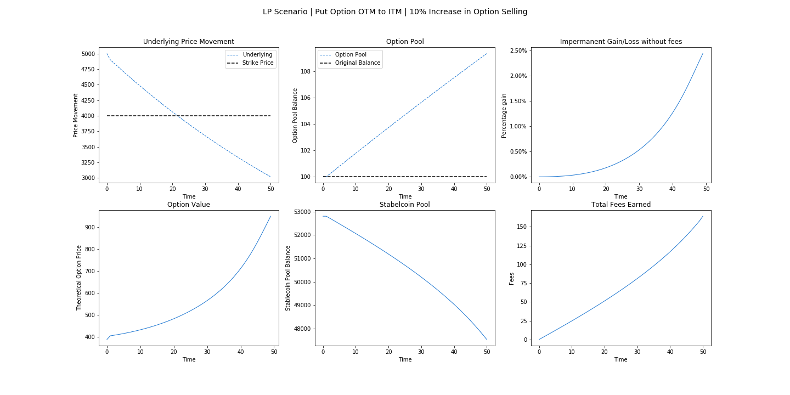
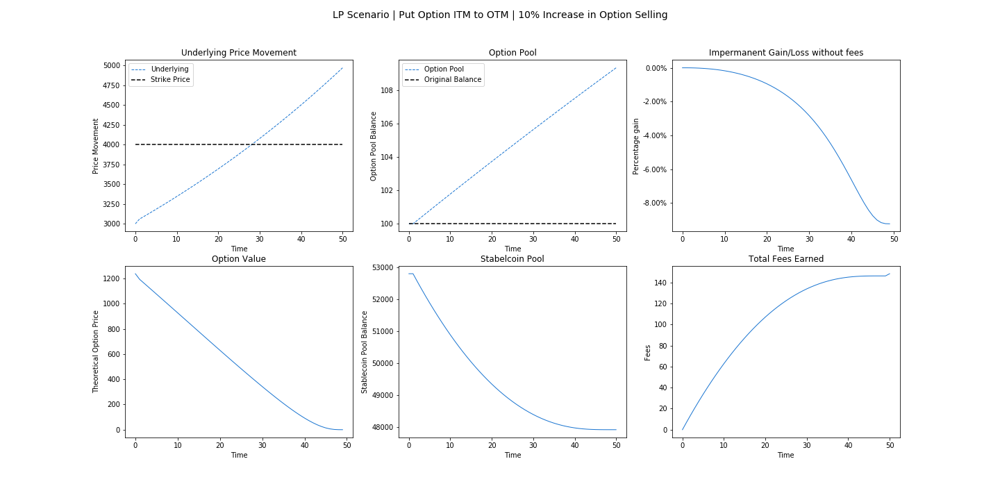

# LP Simulations

Consider a scenario of an ATM put option with a strike of $3000 expiring in 50 days for the sake of simplicity. An LP that provides liquidity of 100 put options  into the options pool and the equivalent value of stablecoins into the stablecoin pool may face a scenario where more option selling on the AMM drives the total balance of options  up by 10% as shown below. The imbalance in total balances shifts the impermanent gain/loss  and the extrinsic value of the option drops as the expiration date approaches. Note that trading fees, being a function of option price, can increase if an option moves further in-the-money, thereby cushioning the risk of exercise for LPs.

Alternatively, an LP may face a scenario where there are more option buyers for his options as the option's extrinsic value decays with time, resulting in an impermanent gain as shown below.

#### LP Monte Carlo Simulation

In the real world what is more likely to take shape is uncertainty about the underlying price movement, but more certainty about users buying options. We simulate 5000 paths of an underlying asset at a price of 3000 and a put option with a strike of 3000 expiring in 50 days with a drift rate of 0, resulting in OTM, ATM, and ITM scenarios in the first column. Afterwards, we stochastically simulate trading behavior of agents buying and selling on the AMM, resulting in imbalances between option tokens \(Total Balance A\) and stablecoins \(Total Balance B\) in the middle column with a drift rate of -0.1\( meaning that, on average, there were 10% more option buyers than sellers over 50 days\). In the third column we show an LP's expected impermanent gain/loss within 95% confidence intervals with protocol fee revenue outlined separately.

#### LP Scenarios with underlying moving away from the At-The-Money \(ATM\) strike

#### LP Scenarios with underlying moving from OTM to ITM

#### LP Scenarios with underlying moving from ITM to OTM

