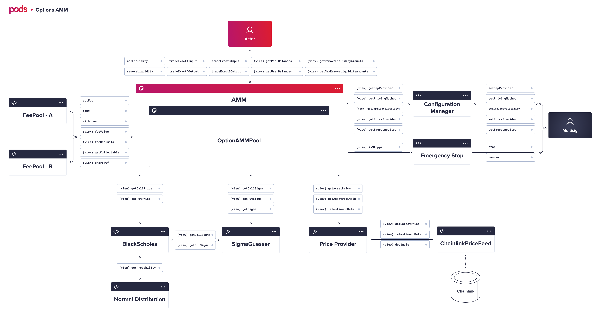

# Smart Contracts

## Main contracts

### OptionAMMFactory

Contract responsible for creating/deploying new AMM pair pools. It has only the following functions:

* createPool\(\) 
* getPool\(\)

### Configuration Manager

Contract responsible for managing all the addresses for the auxiliary contracts. It contains BlackScholes, Sigma, NormalDistribution, and Price Provider setters and getters.

### OptionAMMPool

The contract pool responsible for trade, add and remove liquidity of a pair `PodOption:ERC20`. Some of the actions that you can do:

* addLiquidity\(\) 
* removeLiquidity\(\)
* tradeExactAInput\(\)
* tradeExactAOutput\(\)
* tradeExactBInput\(\)
* tradeExactBOutput\(\)
* getUserBalance\(\)
* getPoolBalances\(\)
* getRemoveLiquidityAmounts\(\)
* getMaxRemoveLiquidityAmounts\(\)

## Auxiliary Contracts

### BlackScholes

Contract responsible for the calculation of the BlackScholes formula for Puts and Calls. This contract uses the `NormalDistribution` contract to calculate the probability functions. You can check the prices using:

* getCallPrice\(\)
* getPutPrice\(\)

### SigmaGuesser

To find the sigma \(also known as implied volatility or IV\) for a given price is not trivial. We need to use a numeric method. This contract is responsible for the interaction process that will find the sigma given a `targetPrice` depending if the option is a Call or a Put. For gas cost purposes, a variable called `sigmaInitialGuess` can be passed to help the numeric method converge faster.

* getCallSigma\(\)
* getCallPut\(\)

### NormalDistribution

Since we do not have libraries to deal with normal distribution functions, and our goal is to be as cost-efficient as possible, we can use  this contract to find probabilities given a Z using:

* getProbability\(\)

### PriceProvider

Contract responsible for finding the `spotPrice` of a given asset that the `priceFeed` was previously registered. This contract can interact with many different price sources and even create an average between feeds. You can use it calling:

* getPriceFeed\(\)
* latestRoundData\(\)
* getAssetPrice\(\)
* getAssetDecimals\(\)
* setAssetFeeds\(\)
* removeAssetFeeds\(\)

### ChainlinkPriceFeed

Its our facade Chainlink contract used to get `spotPrice` and even other data in future like implied volatility:

* getLatestPrice\(\)
* latestRoundData\(\)
* decimals\(\)

### FeePool

Contract responsible for managing the fees paid to the LP providers. This contract is not supposed to be called from an EOA \(external owned account\). We are showing here only to make a more digestible understanding of the whole system.

### Emergency Stop

Contract responsible for pause and resume a certain target contract.

