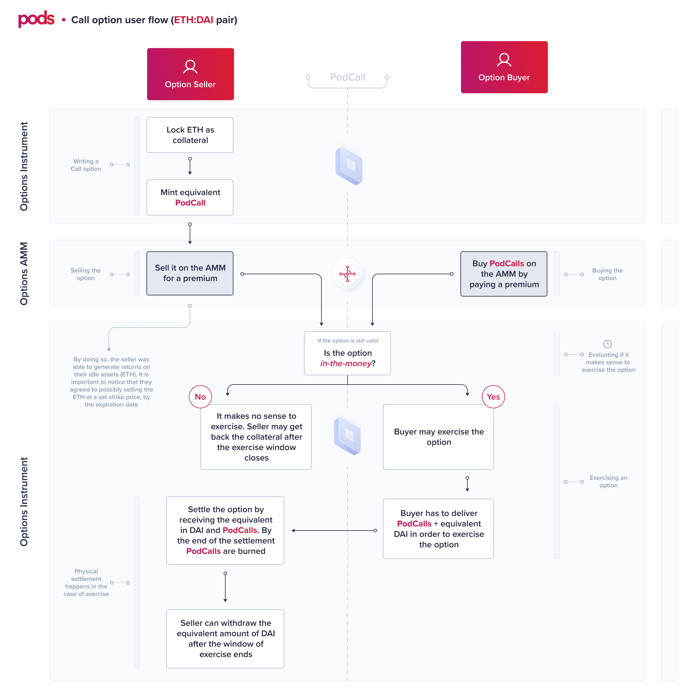
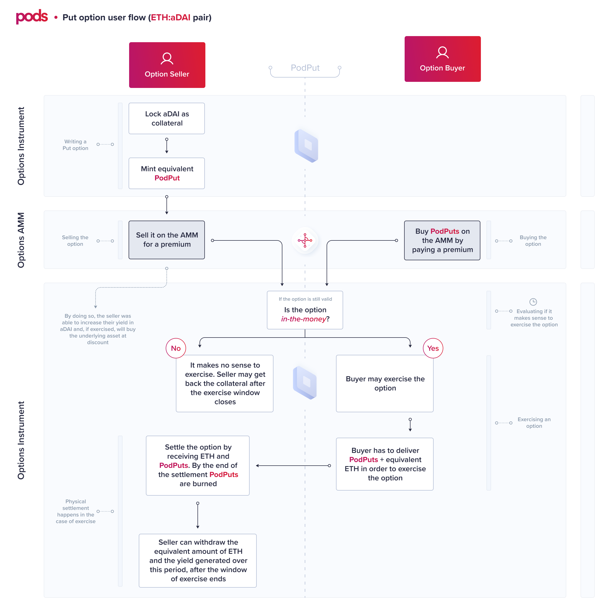

# Overview

## Financial Instrument

Options, like any other derivative, have specific [contract rules](https://app.gitbook.com/@pods-finance-1/s/teste/~/drafts/-MUJTxilQ4CgSOs_VLiH/understand-options/how-options-work). 

> PodOption is our primitive. They can be either PodPuts or PodCalls.

It describes how one can issue, hold and transfer a fungible ERC20 option token for each series.

Find below the general user flow for both calls and puts.

## Characteristics  

### Option Type

Our protocol supports both **puts** and **calls**. Their implementation shares the same logic and structure. The differences from one another will be highlighted in the following sections. 

### Exercise type

The exercise type describes at what moment the buyer can exercise an option contract. Our protocol implemented **European** and **American**\* options. On European options, the buyer **can only exercise its right** during the expiration window. In American, the buyer can exercise **anytime before** the end of expiration.


\*Although the code is ready to receive either American or European options, it is **not recommended** to implement American options using the current pricing model applied on the Options AMM. Find more about this in the [Pricing](https://app.gitbook.com/@pods-finance-1/s/teste/~/drafts/-MUJTd3NADF5p4jYrmxE/options-amm-overview/optionamm/pricing) section. 


### Settlement type

This characteristic describes how an option will be settled after the buyer exercised it.

**PodOptions are physically settled.** 

That means that if a user wishes to exercise its option, he has to:

* In the case of **put** **options**, send both options tokens and underlying assets to unlock and receive the collateral. The amounts should be proportional to the parity of 1:1 underlying asset and option tokens. If they want to exercise 1 option, they should send 1 unit of underlying asset + 1 unit of option and receive the collateral \(in this case is strike price\) like the formula below. 

   The `StrikePrice` is denominated in `StrikeAsset`.  
  
  $$1OptionToken+1UnderlyingAsset=StrikePrice$$  
   
  Example: `1 ETH:aDAI PodPut` **`+`**`1 ETH`**`=`**`400 DAI`

* For example, consider a buyer of a put option on ETH, strike price 400 DAI. The buyer has to send the option tokens and the underlying asset and withdraw the strike asset to exercise the option. 
* In the case of **call options**, send both options tokens and strike assets to unlock and receive the collateral. The amounts should be proportional to the parity described above - if they want to exercise 1 unit of option, they should send strike price to receive 1 unit of the underlying asset. See formula below. The `StrikePrice` is denominated in `StrikeAsset`.

  
  $$1Option + StrikePrice = 1Underlying Asset$$  

  Example: `1 ETH:DAI Token` **`+`**`400 DAI`**`=`**`1 ETH`

* For example, consider a buyer of a call option on ETH, strike price 400 DAI. The buyer has to send the options tokens and the strike price to the contract and withdraw the underlying asset to exercise the option. 

### Options Series

A series is the combination of parameters such as expiry date, the underlying asset, strike price, and strike asset. For instance: 

`put ETH:USDC strike price 300 USDC expiry date December 30th` 

is a different series than 

`put ETH:USDC strike price 300 USDC expiry date December 31st`

## Parameters

To deploy a new option, one needs to describe the following parameters in the [factory contract](https://app.gitbook.com/@pods-finance-1/s/teste/~/drafts/-MUJTxilQ4CgSOs_VLiH/options-protocol-overview/options-smartcontracts/podfactory):

* name
* symbol
* type
* underlying asset
* strike asset
* strike price
* expiration
* window size

## Functions

After creating a new option \(either being a Put or a Call\), there are [four main actions](https://app.gitbook.com/@pods-finance-1/s/teste/~/drafts/-MUJTxilQ4CgSOs_VLiH/options-protocol-overview/podoptions/functions) one can take using the basic contract structure:

* `mint`
* `unmint`
* `exercise`
* `withdraw`

## More Details

### **Options to underlying asset parity**

Options are minted with a 1:1 ratio with the underlying asset amount. 

* To the buyer, a PodPut represents the right to **sell** 1 underlying asset.
* To the buyer,  PodCall represents the right to **buy** 1 underlying asset.

### Collateralization

PodOptions are 100% collateralized. In the case of put options, the collateral is in strike asset, and, in the case of call options, the collateral is in the underlying asset.

### Interest bearing tokens support

Allowing interest-bearing tokens to be used as collateral can **increase user's capital efficiency.** By locking aTokens as collateral, the option seller will be eligible to aTokens yield during the option's life. That is true even if the option expires _in-the-money_. 

For instance, if a user sold 1 unit of a put option `ETH:aUSDC strike price 300a USDC`. It locked 300 `aUSDC` as collateral. By expiration, the 300 `aUSDC` as collateral. By expiration, the 300 aUSDC will have generated interest. Imagine it yielded 5 `aUSDC`.   
If the buyer exercises the option, the seller will receive 1 unit of ETH + 5 aUSDC, and the buyer will receive 300 aUSDC.

Our PodPut and PodCall implementation supports interest-bearing tokens \(or any tokens\) that increase the user `balanceOf()` in time.

That is possible due to our architecture, which stores `shares` based on the user's locked collateral to `mint` options.

### Options Pricing

Pricing is a function of the [AMM component.](https://app.gitbook.com/@pods-finance-1/s/teste/~/drafts/-MUJTxilQ4CgSOs_VLiH/options-amm-overview/optionamm)

### Exercise Window

The exercise window opens 24 hours **before** the expiration date. During this phase, trading in the AMM stops, and users can only exercise their options or remove liquidity from the AMM.

