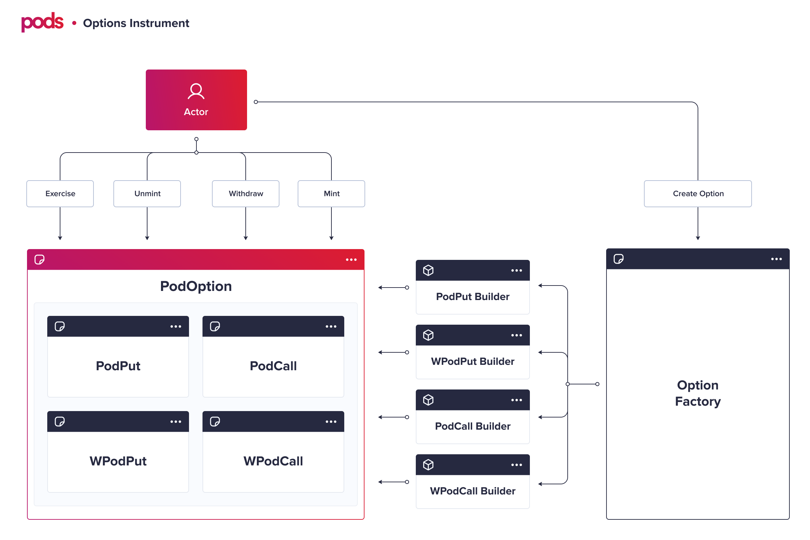

# Smart Contracts

## Main contracts

### OptionFactory

Contract responsible for creating/deploying new option contracts. This contract can create four different  option's contracts: `PodPut`, `WPodPut`, `PodCall`, `WPodCall`. It uses the "[Mega Factory](https://ethereum.stackexchange.com/questions/12698/need-help-to-break-down-large-contract)" pattern, where it uses auxiliary "builder" contracts \(`PodPutBuilder`, `WPodPutBuilder`, `PodCallBuilder`, `WPodCallBuilder`\). From the users/developer's perspective, they do not need to interact with those auxiliary contracts. OptionFactory has only one function:

* [createOption](podfactory.md#createoption)\(\) 

### PodPut

The contract for American or European **Put** options. It works with any `ERC20` pair as the strike asset and underlying asset. This contract is also compatible with [aTokens](https://docs.aave.com/developers/the-core-protocol/atokens) on the strike asset or the underlying asset. It is possible to interact with the contract mainly using:

* [mint\(\) ](sm-podput-1.md#mint)
* [unmint\(\)](sm-podput-1.md#unmint)
* [exercise\(\)](sm-podput-1.md#exercise)
* [withdraw\(\)](sm-podput-1.md#withdraw)

### WPodPut

Same logic as the **PodPut**, but with some special function to convert `ETH` into `WETH`. The underlying asset of that contract **must** be the [official WETH address](https://etherscan.io/token/0xc02aaa39b223fe8d0a0e5c4f27ead9083c756cc2). The only function that has a different signature is the`exerciseEth.` Although the other functions work differently under the hood, they have the same signature of the `PodPut`:

* [mint\(\) ](sm-podput-1.md#mint)
* [unmint\(\)](sm-podput-1.md#unmint)
* [exerciseEth\(\)](sm-podput-1.md#exercise)
* [withdraw\(\)](sm-podput-1.md#withdraw)


If you want to manage `WETH` / `ETH` conversion yourself, you can simply use **PodPut** with `WETH` in the underlying asset parameter.



If you are using WPodPut on a testnet, you should use a contract address for the underlying asset with the same interface of the mainnet WETH. You can check our WETH address for testnets on our [deployed contracts page](../../developers/deployed-contracts.md).   


### PodCall

The contract for American or European **Call** options. It works with any `ERC20` pair as the strike asset and underlying asset. This contract is also compatible with [aTokens](https://docs.aave.com/developers/the-core-protocol/atokens) on the strike asset or the underlying asset. It is possible to interact with the contract mainly using:

* [mint\(\)](sm-podput.md#mint) 
* [unmint\(](sm-podput.md#unmint)\)
* [exercise](sm-podput.md#exercise)\(\)
* [withdraw\(\)](sm-podput.md#withdraw)

### WPodCall

Same logic as the **PodCall**, but with some special function to convert `ETH` into `WETH`. The underlying asset of that contract **must** be the [official WETH address](https://etherscan.io/token/0xc02aaa39b223fe8d0a0e5c4f27ead9083c756cc2). The only function that has a different signature is the `mintEth`. Although the other functions work differently under the hood, they have the same signature of the `PodPut`:

* [mintEth\(](wpodcall.md#minteth)\) 
* [unmint\(\)](sm-podput.md#unmint)
* [exercise\(\)](sm-podput.md#exercise)
* [withdraw\(\)](sm-podput.md#withdraw)


If you want to manage `WETH` / `ETH` conversion yourself, you can use **PodCall** with `WETH` in the underlying asset parameter.



If you are using **WPodCall** on a testnet, you should use a contract address for the underlying asset with the same interface of the mainnet `WETH`. You can check our `WETH` address for testnets on our [deployed contracts page](../../developers/deployed-contracts.md).  


## Auxiliary Contracts

### PodPutBuilder / PodCallBuilder / WPodPutBuilder / WPodCallBuilder

All those contracts are the direct factories of the Option contracts. We will not cover them in our documentation, but you can check directly on our code. Check our Github. They all have the same function and parameters used to deploy a new option contract:

* buildOption\(\) 

