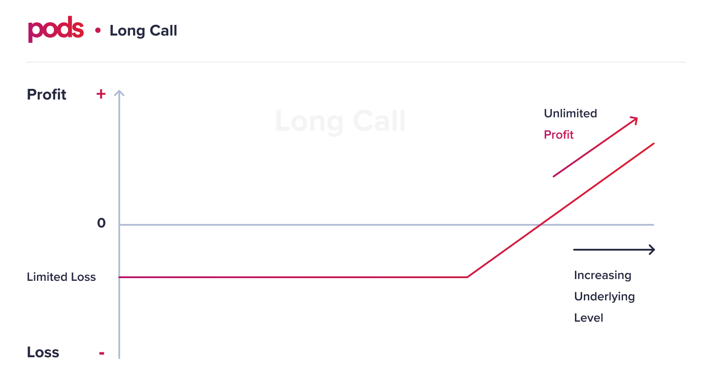
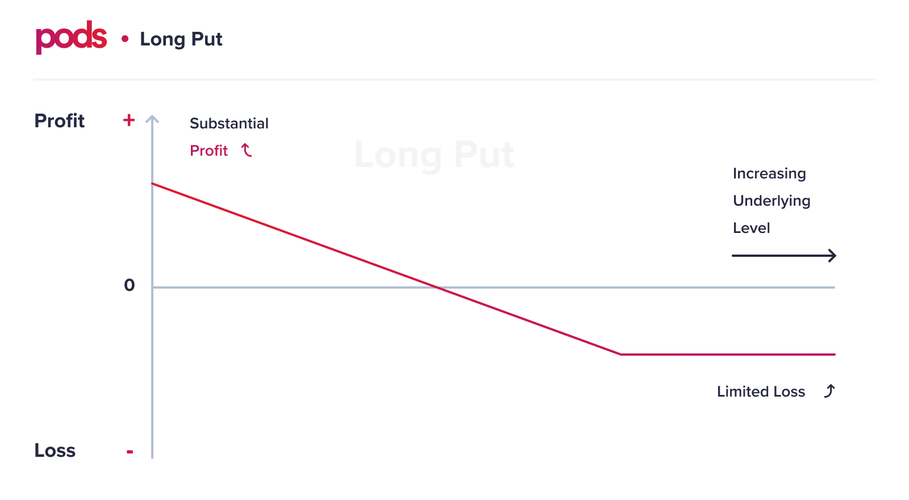

# Understanding Returns

## Understanding Returns

### Call Option

Let's take the following call option and use it as our example: 

_PodCall WETH:USDC 700 Dec 31st_

|  | Description |
| :--- | :--- |
| underlying asset | WETH |
| strike asset | USDC |
| option type | Call |
| exercise type | European |
| strike price | $700 |
| spot price | $500 |
| expiration | 31 Dec 2020 |
| current day | 21 Nov 2020 |
| premium | $20 |

In this example, the contract refers to a **call** option for **WETH:USDC** that can be exercised only at expiration on the **31 Dec 2020** as it is a **European** option with a strike price of **$700**, where ****the options market price, also called as **premium**, is **$20**. In other words, this option buyer paid $20 to have the option to buy the WETH for $700 from the option seller, who has an obligation to sell the underlying asset, once the option is exercised, regardless of the spot price the asset at the expiration. 

The following scenarios could happen:

#### **1\) WETH Spot price on the 31 Dec 2020 = $900**

In this case, it would be profitable for the option buyer to exercise the call option as the asset would be sold for $200 discount from the prices in the market. In this situation, the option is _in-the-money_ \(ITM\).  Once exercising the option, the option buyer would have had the following \(simplified\) profit:

Profit = Spot price - Strike price - Premium 

Profit = 900 - 700 - 20 

Profit = $180 


The same would happen to any spot price above the strike price + premium. 


#### **2\) WETH Spot price on the 31 Dec 2020 = $500**

In this case, it doesn't make sense for the option buyer to exercise his option as it is possible to buy the underlying asset \(WETH\) for a cheaper price in the market. In this situation, we say that the option is _out-of-the-money_ \(OTM\). As the option buyer paid the premium, we can say that he had a loss limited to the option's price, which is $20. 

Loss = - $20

**Conclusion**

It is possible to see that for call options, the **loss is limited** to the premium, and the **profit is unlimited** as the price of the underlying asset increases, as shown in the graph below:

### Put Option

Let's take the following call option and use it as our example: 

_PodPut WETH:USDC 400 Dec 31st_

|  | Description |
| :--- | :--- |
| underlying asset | WETH |
| strike asset | aUSDC |
| option type | Put |
| exercise type |  European |
| strike price | $400 |
| spot price | $500 |
| expiration | 31 Dec 2020 |
| current day | 21 Nov 2020 |
| premium | $30 |

In this example, the contract refers to a **put** option for **WETH:USDC** that can be exercised only at expiration on the **31 Dec 2020** as it is a **European** option with a strike price of **$400**, where ****the options market price, also called as **premium**, is **$30**. In other words, this option buyer paid $30 to have the option to sell the WETH for $400 to the option seller, who has an obligation to buy the underlying asset, once the option is exercised, regardless of the spot price the asset at the expiration. 

The following scenarios could happen:

#### **1\) WETH Spot price on the 31 Dec 2020 = $300**

In this case, it would be profitable for the option buyer to exercise the put option as the asset would be sold for $100 more than the current price in the market. In this situation, the option is _in-the-money_ \(ITM\).  Once exercising the option, the option buyer would have had the following \(simplified\) profit:

Profit = Strike price - Spot Price - Premium 

Profit = 400 - 300 - 30 

Profit = $70


The same would happen to scenarios where the spot price is below the strike price until the asset's price reaches 0.


#### \*\*\*\*

#### **2\) WETH Spot price on the 31 Dec 2020 = $600**

In this case, it doesn't make sense for the option buyer to exercise the option as it is possible to sell the underlying asset \(WETH\) for a higher price in the market. In this situation, we say that the option is _out-of-the-money_ \(OTM\). As the option buyer paid the premium, we can say that he had a loss limited to the option's price, which is $30. 

Loss = premium 

Loss = - $30

**Conclusion**

It is possible to see that for put options, the **loss is limited** to the premium, and the **profit is restricted/limited** until the spot price of the underlying asset decreases until zero, as we can see in the graph below:

### 

