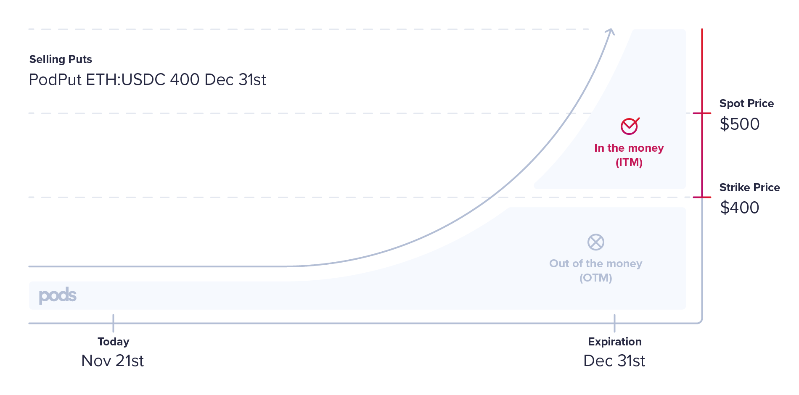
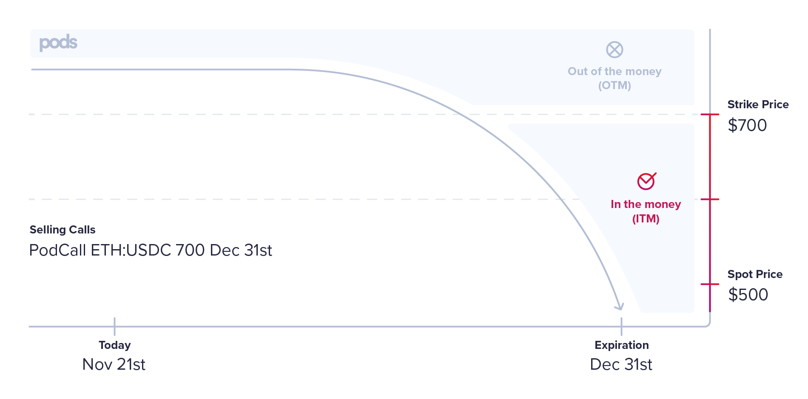
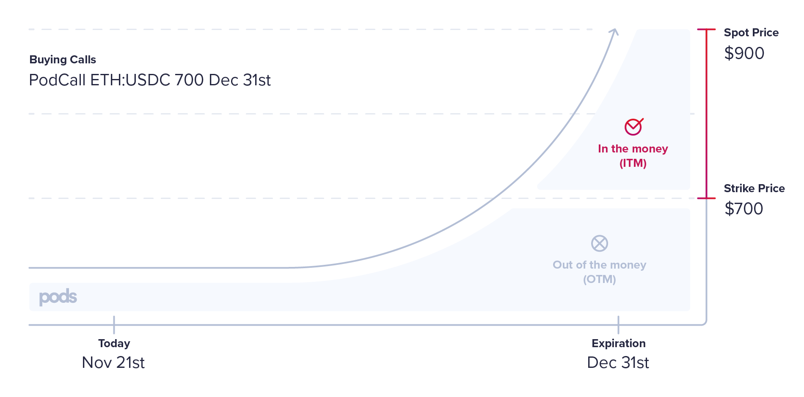

# Applied Use Cases

## Example 1 - Selling Puts

Imagine Rob is very bullish on ETH. He frequently buys more ETH to increase his portfolio, and he usually thinks about an entry price that he feels is good to buy more ETH given the moment of the market. Instead of going to an order book or Matcha and placing a limit order, he prefers to sell Put options for the strike price equal to the entry price he has in his strategy. In that way, it is a win-win situation for him:

**a\)** If the `spot price` hits the `strike price` and his position is exercised, he ended up buying the `underlying asset` \(`ETH`\) for the price he was willing to purchase AND earned a `premium` for that. 


We say in this situation that the option was in the money \(ITM\)


**b\)** On the other hand, if the `spot price` does not hit the `strike price`, Rob will have earned the `premium`, and he can try selling another option again at a new `strike price` if he wants. Additionally, our options accept aTokens as collateral, so it is possible to earn interest in addition to the premium.


We say in that case that the option was out of the money \(OTM\)


### Scenario 

Here, we will follow a user flow of a seller \(Rob\) of a `PodPut`.  He will:

* Lock `strike asset` as `collateral` to `mint` options and hold his position with  `shares` of the contract.
* Rob will then get the new-minted options and `sell` them on our `AMM` for a `premium` \(For details on how the calculation for the premium works, check out the [how our price works section](../options-amm-overview/optionamm/pricing.md)\).
* In this scenario, we will assume that the `spot price` became lower than the `strike price`, and some options were partially exercised.
* After the `expiration`, Rob will be able to `withdraw` his `collateral` based on the number of `shares` he has.
* The collateral will be returned partially in the `strike asset` and partly in the `underlying asset`.

Let's add some numbers as an example to illustrate better:

| Input Name | Description |
| :--- | :--- |
| underlying asset | WETH |
| strike asset | aUSDC \(a collateral asset in case of Puts\) |
| option type | Put |
| exercise type |  European |
| strike price | $400 |
| spot price | $500 |
| expiration | 31 Dec 2020 |
| current day | 21 Nov 2020 |

### Minting options

So, let's say that Rob  has `1200 aUSDC` and is willing to buy a max of 3 units of `ETH` at the `strike price`. The following steps will occur:

* Rob calls the `mint` function with two parameters: `amountOfOptions` and `owner`.
* `amountOfOptions`will be equal to 3 and `owner`will be Rob's address.
* Rob needs to call `approve()` on the `strike asset aUSDC` contract allowing the `PodPut` contract to spend his `1200 aUSDC`.
* The contract will calculate the `amountToTransfer` that will be equal to `amountOfOptions * strikePrice` that will equal `1200 aUSDC` in our case.
* The contract will also store the number of `shares` Rob has from the `PodPut` contract using the following equation: 

  * `ownerShares = amountToTransfer * totalShares / (strikeReserves + underlyingReserves * strikePrice)`
  * Let's assume that in our case, the contract has 4000 `totalShares`and a`strikeReserves` of `4050 aUSDC.`

  * Therefore, Rob has `1200 * 4000 / 4050 shares`. Resulting in `1185.185 shares.`

* The contract will then call the`transferFrom` function from the `strike asset` contract using`amountToTransfer` as a parameter.


`strikeReserves` and `underlyingReserves` represent the PodPut contract balance of strike and underlying.


### Exercise

Fast forward to Dec 31, 2020. Babi, who has bought two options in the secondary market, has 24h to exercise her options before the `exerciseWindow` ends. The spot price is currently at  $300

* Babi calls the `exercise` function, passing the `amountOfOptions` she wants to exercise.
* She needs to call `approve()` on the `underlying asset WETH` contract, allowing the `PodPut` contract to spend her `underlying asset` and give her back an amount of the `strike asset`.
* The amount of `underlying tokens` the PodPut will use to call the`transferFrom` function will be 1:1. So, in our case, if she wants to exercise two options, two units of `underlying asset` will be transferred to PodPut, increasing the`underlyingReserves.`
* Babi will receive back `amountOfOptions * strikePrice` units of the`strike asset.` In this case, `2*400 = 800 aUSDC` units.


If the spot price was, let's say $300, and she paid $20 in her options. Her returns will be `(strike price - spot price) * amountOfOptions - premium`


### Withdraw

Now 24h passed, and Rob is enabled to withdraw his collateral. Remember that Rob had `0.007407 shares`? Let's see how many strike and underlying he will receive back. We will assume that PodPut had no new sellers, and aUSDC strike balance increased a little, earned some interest during that time. So right now, our balances are:

* `strikeReserves` = 4500 `aUSDC`  \(4050 we had initially, plus 1200 from Rob, less the amount the PodPut used to pay Babi back during her exercise, plus some interest earned during this time\) 
* `underlyingReserves` = 2 `WETH`
* `totalShares` = 5185,185

To calculate how many `strikeToReceive` and `underlyingToReceive` the contract will receive, we do the following calculations:

* `strikeToReceive = ownerShares * strikeReserves / totalShares`
* `underlyingToReceive = ownerShares * underlyingReserves / totalShares`

In this situation,  Rob will receive back `1185,185 * 4500 / 5185,185 = 1028,571 strike asset.` In addition to that, he will receive also `1185,185 * 2 / 5185,185 = 0,45714 underlying asset`

## Example 2 - Unminting Puts

Let's suppose that Rob from the previous example believes that it's not worth holding the position of selling a put option to buy `ETH` for the `strike price` he has previously set. This could happen for many reasons:

1. Wants to use the collateral for other purposes instead of having it locked in
2. He believes he can find a more profitable operation within another set of options.

### Scenario

Here, we will follow a user flow of an owner/seller \(Rob\) of a PodPut. He will:

* Decide how many options he wants to unmint to leave his position by reducing the contract's number of shares.
* To unmint, the options will need to be burned. Consequently, Rob will need to have the options in the wallet he used to mint the options to do so.
* In case Rob already sold his options in our AMM for a `premium`, he will have to buy the number of the options he wants to `unmint` from the same series to leave the position.
* It is important to have in mind that if Rob has to buy back the options to call the unmint function, there is no guarantee the option will be the same as the premium he received for selling the option from the same series.

Let's add some numbers as an example to illustrate better:

| Input Name | Description |
| :--- | :--- |
| owner | Rob |
| owner shares | 1185.185 |
| user-minted options | 3 |
| amount of options to withdraw | 1 |
| strike asset aUSDC \(collateral\) | 1200 |
| total shares | 5185.185 |
| strike asset | aUSDC |
| underlying asset | WETH |
| strike price | $400 |
| expiration | 31 Dec 2020 |
| current day | 15 Dec 2020 |
| exercise type | European |

So, let's say that Rob wants to leave his position on 1 put option he had previously minted in the Example 1, getting back the collateral at the strike price of `400 aUSDC`. The following steps will occur:

* Rob calls the `unmint` function with two parameters: the amount of options to `unmint` and owner.
* amount of options to `unmint` will be equal to `1` and owner will be Rob's address.
* Rob needs to call `unmint()` on the option contract
* The contract will calculate the `ownerShares` of Rob to have the number of the protocol's shares the user will unmint.
  * `ownerShares_w =(amountOfOptionsToWithdraw ∗ ownerShares_i-1)/ userMintedOptions`
  * So: `amountOfOptionstoWithdraw` will be equal to 1 and `ownerShares_i-1` is equal to `1185.185` and the `userMintedOptions` will be equal to 3. Therefore, `ownerShares_w` will be equal to `395.06`.

We will assume that PodPut had no new sellers, and aUSDC strike balance increased a little, earned some interest during that time. Furthermore, no options were exercised yet as we did not reach the expiration date. So right now, our balances are:

* `strikeReserves` = 5300 `aUSDC` \(4050 we had initially, plus 1200 from Rob, plus some interest earned during this time\)
* `totalShares` = 5185.185 `shares`

To calculate how many `strikeToSend` the contract will send, we do the following calculations:

* `strikeToSend=(ownerShares_w∗OSBn)/totalShares_i−1`

In this situation, Rob will receive:

`395.06 * 5300 / 5185.185 = 403.807` strike asset which in this case is `aUSDC`.

By the end of this process, the new balances will be the following:

| Variable | Formula | Value |
| :--- | :--- | :--- |
| totalShares\_i | `totalShares_i = totalShares_i−1 − ownerShares_w` | = 5185.185 - 395.06 = 4,790.125 shares |
| ownerShares\_i \(Rob\) | `ownerShares_i = ownerShares_i−1 − ownerShares_w` | =1185.185 - 395.06 = 790.125 shares |
| strikeReserves \(sRi\) | `sRi = sRi-1 - strikeToSend` | = 5300 - 403.807 = 4,896.193 |

## Example 3 - Buying Puts

Let's take Babi from the 1st example and drill down what steps she had to go through to buy two `put` options from Rob.

Babi is `bearish` on `ETH` and wants to reduce her exposition to the asset by buying a put option with a strike price that is lower than the current `spot price` of $500 but that still limits her potential loss according to her feeling about the asset. In case the price of `ETH` falls below $500, she will be able to exercise her option and sell her asset for a higher price than the `spot price`, being able to profit on that. Let's take the following example:

* `Spot price` of `ETH` at expiration: 300 `USDC`
* `Strike price`: 500 `USDC`


In this case, the option is in the money \(ITM\).


She knows the pricing of options needs to take into consideration important variables such as implied volatility and the time to maturity, so she goes to the AMM as she knows she will pay a premium that correctly translates the value of the option at the time she gets to buy the option. \(For details on how the calculation for the premium works, check out [Pricing](https://app.gitbook.com/@pods-finance-1/s/teste/~/drafts/-MU6ZVfqbnZEcmT18mVa/options-amm-overview/optionamm/pricing)\).

* The pricing of the put option was of 20 `USDC` each.

Considering the conditions above, Babi would be able to sell the asset for 500 USDC, which is higher than the ETH market offers. Taking into consideration that she paid 20 `USDC` for 2 put options from Pods' AMM, Babi made a profit of: 2 \* \(500 - 300\) - 2 \* 20 = 360 `USDC`.

In case the option is **OTM**, which means that the spot price of ETH was higher than the strike price, there would be no reason for Babi to exercise her put option as she would be selling the asset for a lower price than what the market is currently offering. In this case, she would have lost only the amount of the premium paid for the options bought in Pods' AMM.

## Example 4 - Selling Calls

Imagine Gabriel is long and bullish on ETH. Gabriel has a lot of ETH exposure in his portfolio, and one of the things he could do to increase his passive income on his current assets is to sell call options on ETH. By doing so, Gabriel agrees that he will get a premium for selling the options \(and therefore generative a yield on the idle assets\) and take the risk of being exercised \(sell ETH at the strike price if the buyer chooses to exercise\).

a\) If the `spot price` surpasses the `strike price` and his position is exercised, he ended up selling the `underlying asset` \(`ETH`\) for a lower price than what the asset is worth in the market.


We say in this situation that the option was in the money \(ITM\)


b\) On the other hand, if the spot price does not surpass the strike price, Gabriel will have earned the premium.


We say in that case that the option was out of the money \(OTM\)


### Scenario

Here, we are going to follow a user flow of a seller \(Gabriel\) of a PodCall He will:

* Lock underlying asset \(ETH\) as collateral to min option and hold his position with the contract shares.
* Gabriel will then get the minted options and sell them on our AMM for a premium \(For details on how the calculation for the `premium` works, check out the how our price works section\).
* In this scenario, we will assume that the spot price became higher than the `strike price`, and some options were partially exercised.
* After the `exerciseWindow`, Gabriel will be able to withdraw his collateral based on the amount of shares he has.
* The collateral will be returned partially in the strike asset, and partially in the `underlying asset`.

Let's add some numbers as an example to illustrate better:

| input name | Description |
| :--- | :--- |
| underlying asset | WETH \(a collateral asset in case of Calls\) |
| strike asset | USDC |
| option type | Call |
| exercise type | European |
| strike price | $700 |
| spot price | $500 |
| expiration | 31 Dec 2020 |
| current day | 21 Nov 2020 |

### Minting Options

So let's say that Gabriel has 4 ETH and believes that selling each of them at the strike price of 700 `aUSDC` is fair. The following steps will occur:

* Gabriel alls mint function with two parameters: `amountOfOptions` and owner.
* `amountOfOptions` will be equal to 4 and owner will be Gabriel's address.
* Gabriel needs to call approve\( \) on the `underlying` asset ETH contract allowing the PodCall contract to spend his 4 ETH.
* The contract will calculate the `amountToTransfer` that will be equal to `optionsAmount` of the `underlyingAsset` that will equal to 4 `ETH` in our case.
* The contract will also store the number of shares Gabriel has from the PodCall contract using the following equation:
  * `ownerShares = (amountToTransfer * totalShares_i-1) / (underlyingReserves_i + (strikeReserves_i / strikePrice))`
  * Let's assume that in our case the contract has 500 `totalShares` and an `underlyingReserve` of 580
  * Therefore, Gabriel has 4 \* 500 / 580 shares. Resulting in 3.448 `shares`.
* The contract will then call the `transferFrom` function from the `underlying asset` contract using `amountToTransfer` as a parameter.


`strikeReserves` and `underlyingReserve` represent the PodCall contract balance of `strike` and `underlying`.


### Exercise

Fast forward to Dec 31, 2020. Gui, who has bought three options in the secondary market, has 24h to exercise his options before the `exerciseWindow` ends. The `spot price` is currently at $900.

* Gui calls the exercise function, passing the `amountOfOptions` he wants to exercise.
* He needs to call `approve()` on the strike asset `USDC` contract, allowing the `PodCall` contract to spend his strike asset and give him back and amount of the `underlying asset` \(`ETH`\).
* The amount of underlying tokens the `PodCall` will use to call the `transferFrom` function will be 1:1. So, in our case, if he wants to exercise three options, three units of the `strike asset` will be transferred to `PodCall`, increasing the `strikeReserves`.
* Gui will receive back the `amountOfOptions` units of the `underlying asset`. In this case, 3 `ETH` units.


If the `spot price` was let's say $1000 and he paid $20 in her options. Her returns will be `(spot price-strike price) * amountOfOptions - premium`


### Withdraw

Now 24h passed, and Gabriel can withdraw his collateral. Remember that Gabriel had 0.1428 shares? Let's see how many strikes and underlying he will receive back. We will assume that during that time, PodCall had no new sellers. So right now, our balances are:

* `strikeReserves` = 2100 `aUSDC` \(3 call options with the `strike price` of $700 were exercised\)
* `underlyingReserve`= 581 `WETH` \(500 `ETH` we had initially plus 4 from Gabriel minus the 3 PodCall used to pay Gui during his exercise\).
* `totalShares` = 503.448 `shares`

To calculate how many `strikeToSend` and `underlyingToSend` the contract will receive, we do the following calculations:

* `strikeToSend = ownerShares * strikeReserves / totalShares`
* `underlyingToSend = ownerShares * underlyingReserve / totalShares`

In this situation, Gabriel will receive back:

`strikeToSend` = 3.448 \* 2100 / 503.448 = 14.382 `USDC`

`underlyingToSend` = 3.448 \* 581 / 503.448 = 3.979 `ETH`

## Example 5 - Unminting Calls

Let's suppose that Gabriel from the previous example believes that it's not worth holding the position of selling a `call option` to sell `ETH` for the strike price he has previously set. This could happen for many reasons:

1. Wants to use the `collateral` for other purposes instead of having it locked in.
2. He believes the price of `ETH` will surpass the `strike price` making it more profitable to sell the asset for the `spot price`.
3. Believes he can find a more profitable operation within another set of options

### Scenario

Here, we are going to follow a user flow of an owner/seller \(Gabriel\) of a `PodCall`. He will:

* Decide how many options he will want to unmint to leave his position by reducing the contract's number of shares.
* To `unmint`, the options will need to be `burned` so, consequently, Gabriel will need to have the options in the wallet he used to `mint` the options to do so.
* In case Gabriel already sold his options in our AMM for a `premium`, he will have to buy the number of the options he wants to `unmint` from the same series to leave the position.
* It is important to have in mind that if Gabriel has to buy back the options to call the unmint function, there is no guarantee the option will be the same as the premium he received for selling the option from the same series.

Let's add some numbers as an example to illustrate better:

| input name | Description |
| :--- | :--- |
| owner | Gabriel |
| ownerShares | 3.448 |
| userMintedOptions | 4 |
| amountOfOptionsToWithdraw | 2 |
| underlying asset \(collateral\) | 4 |
| totalShares | 503.448 |
| strike asset | USDC |
| underlying asset | WETH |
| strike price | $700 |
| expiration | 31 Dec 2020 |
| current day | 15 Dec 2020 |
| exercise type | European |

So, let's say that Gabriel wants to leave his position on 2 `call options` he had previously minted in the Example 3, getting back the `collateral` of 2 `ETH`. The following steps will occur:

* Gabriel calls the `unmint` function with two parameters: `amount of options` to `unmint` and `owner`.
* amount of options to `unmint` will be equal to 2 and owner will be Gabriel's address.
* Gabriel needs to call \[function\] on the strike
* The contract will calculate the `ownerSharesw` of Gabriel to have the number of the protocol's shares the user will `unmint`.
  * `ownerSharesw =(amountOfOptionsToWithdraw∗ownerShares_i−1)/ userMintedOptions`
  * So: `amountOfOptionstoWithdraw` will be equal to 2 and `ownerShares_i-1` is equal to 3.448 and the `userMintedOptions` will be equal to 4. Therefore, `ownerShares_w` will be equal to 1.724.

We will assume that during that time, `PodCall` had no new sellers and `ETH` underlying balance. Furthermore, no options were exercised yet as we did not reach the `expiration date`. So right now our balances are:

* `underlyingReserve` = 584 `ETH` \(580 we initially had plus 4 from Gabriel\).
* `totalShares` = 503.448

To calculate how many `underlyingToSend` the contract will send, we do the following calculations:

* `underlyingToSend` = 2 `ETH`

By the end of this process, the new balances will be the following:

| Name | Formula | Value |
| :--- | :--- | :--- |
| totalShares\_i | `totalShares_i = totalShares_i−1 − ownerShares_w` | = 503.448 - 1.724 = 501.724 `shares` |
| ownerShares\_i \(Gabriel\) | `ownerShares_i = ownerSharesi−1 − ownerSharesw` | = 3.448 - 1.724 = 1.724 `shares` |
| underlyingReserve \(uRi\) | `OUBi = OUBi-1 - underlyingToSend` | = 584 - 2 = 582 `ETH` |

## Example 6 - Buying Calls

Let's take Gui from the 4th example and drill down what steps she had to go through to buy 3 `call options` from Gabriel.

Gui is `bullish` on `ETH` and wants to buy a call option with a `strike price` that will be lower than the `spot price` by the time of the option's expiry. If this happens, he will be buying `ETH` for cheaper than what the market is charging and would be able to profit on that. Let's take the following example:

* `Spot price` of `ETH` at expiration: 900 `USDC`
* `Strike price`: 700 `USDC`


In this case, the option is in the money.


He knows the pricing of options needs to take into consideration important variables such as implied volatility and the time to maturity so she goes to Pods Finance's AMM as she knows she will pay a premium that correctly translates the value of the option at the time she gets to buy the option. \(For details on how the calculation for the premium works, check out the how our price works section\).

* The pricing of the call option was  20 `USDC` each.

Considering the conditions above, Gui would be able to buy the asset for 700 `USDC` and then sell the `ETH` in the market for 900 `USDC`. Taking into consideration that he paid 20 `USDC` for 3 `call options` from Pods' AMM, Gui made a profit of: 3 \* \(900 - 700\) - 3 \* 20 = 540 `USDC`.

In case the option is `OTM`, which means that the `spot price` of `ETH` was below the strike price, there would be no reason for Gui to exercise his `call option` as he would be buying the asset for a higher price than what the market is currently offering. In this case, he would have lost only the amount of the `premium` paid for the options bought in Pods' AMM.

