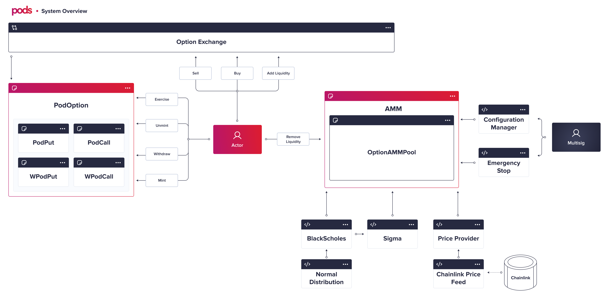

# Safety Measures

There are many risks associated with Defi protocols, and Pods Protocol is no different. Users must be aware of them when using any decentralized application and never use funds they are unwilling to lose completely.

Pods will launch the protocol on mainnet with a Guarded Launch. The Guarded Launch attempts to increase users' safety and limit the community's losses in a bug, hack or exploit's situation. Safety measures allow for an interactive launch of a full-featured product with limited liquidity.

Currently, the measures include the existence and control of **admin keys** and **caps.**

### **Cap**

**Caps** are defined \(and can be changed throughout the option's lifetime\) to control the maximum amount of **options tokens minted** and the maximum amount of **stablecoins added as liquidity** to the Options AMM. We plan to gradually increase the cap limit as the code proves itself economically and systematically stable.

### Admin powers

‌The Pods Team currently holds admin keys on the protocol, with a multi-sig wallet. We intend to burn the admin keys as the code proves itself economically and systematically stable.

Below we explain in detail what are the current powers of the keys the team holds.

The admin is capable of:

* **Increasing / Decreasing Cap**
  * The Option Instrument has a cap for the number of options \(tokenA\) users can mint on each live option series. Simultaneously, the Options AMM has a cap for the number of stablecoins \(tokenB\) that can be added as liquidity to the pool. The admin controller can decide the size of the cap at any time during the option's life.
* **Change contract addresses of the peripherals contracts**
  * Our core contract **OptionAMMPool** is supplied with data from other sources. For example, spot price feeds Black Scholes to calculate the premium and the next sigma.
  * Pricing Method, Oracles, and Implied Volatility contracts can be swapped if there's a future iteration with improvements.
  * The admin can change the address of those contracts, but not the logic of the OptionAMMPool itself.
  * Addresses are kept by the ConfigurationManager contract, which itself is secured by a multi-sig wallet.
* **Emergency Stop**
  * The Emergency Stop power describes the ability to pause and resume all the OptionAMMPool contract operations \(add liquidity, trade, or remove liquidity\).

## Architecture

