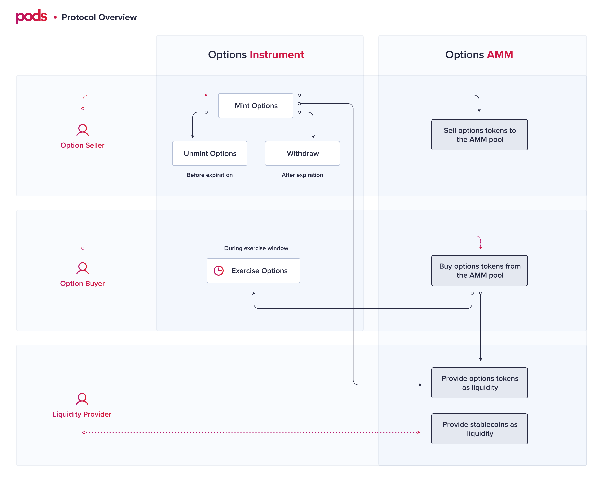

# Overview

## How it works

The combination between the Options Instrument and the Options AMM is what comprises Pods Protocol.

### **Options Instrument**

The options instrument describes how a user can create and manage an option token.

Users can `mint`, `unmint`, `exercise`, and `withdraw` both **calls** and **puts.** The implementation requires the options to be fully collateralized. The options can be **European** or **American\*** and have a **physical** settlement, leaving no liquidation systems exposure. The general functions are mint options tokens, unmint, exercise, and withdraw funds after expiration.


\*Although the code is ready to receive either American or European options, it is **not recommended** to implement American options using the current pricing model applied on the Options AMM. Find more about this in the Pricing section. 


The Options Instrument only defines the functions that will impact the creation of an option and its exercise. The trading and pricing facilities are held in the Options AMM. 

* Options tokens are standard ERC20 tokens and can potentially be sold on DEXes, P2P, and OTC desks.
* Anyone can create new options series at any time. 

### **Options AMM**

Pricing and trading options tokens happen in the [options AMM](https://docs.pods.finance/options-amm-overview/optionamm). For that to happen, the Options AMM:

* Enables single-sided liquidity provision.
* Algorithmically prices the options using Black Scholes.
* Update factors such as time to maturity and spot price.
* Programmatically updates the Implied Volatility. For more details, check [Pricing](https://docs.pods.finance/options-amm-overview/optionamm/pricing). 

The AMM pools are created and expire within the option's lifetime. After an option enters the exercise window, trading stops, and users can only remove funds from the pool and exercise the options \(if they are in the money\). 

Users that created options can only withdraw the collateral \(or underlying asset, in case of an exercised option\) locked in the Option Contract after the exercise window closes.

### **Overall System Flow**

1. **Create**
   1. **Create an option series** Anyone can create a new option series using our non-upgradable contracts from the Options Instrument.
      1. **Mint options** Option sellers can lock collateral and _mint_ \(or create\) options tokens to provide liquidity to the pool in its opening moment or to sell the options tokens in another DEX. If the user chooses to leave the position before the expiration, they can do so by repurchasing the option amount and using the _unmint_ function.
   2. **Create an option pool in the AMM** Anyone can create a new option pool using the Options AMM, just like starting new pools in Uniswap.
      1. **Add initial liquidity to the pool** To create a new pool a user have to add liquidity on both sides \(options tokens and stablecoins\) equally. After the first moment, the one-sided liquidity provision is unlocked, and anyone can add liquidity users can deposit either both assets or only one asset. 
2. **Providing additional liquidity to the pool** Liquidity providers can provide liquidity to the pool with stablecoins or options tokens. They can either create new options tokens by locking collateral in the contract and minting new tokens or they can buy options tokens in the AMM and provide them as liquidity. 
3. **Buy and sell options on the AMM** Users can sell or buy \(to and from the pool\) until the beginning of the expiration window. When the expiration window starts trading stops and options holders can exercise their options and liquidity providers can withdraw their funds from the AMM. 
4. **Exercise** Options buyers have a specific and pre-determined exercise window of 24 hours to exercise their options. 
5. **Remove liquidity from the pool** When the exercise window starts, the only possible action regarding the Options AMM is to withdraw funds from the pool. 
6. **Withdraw collateral** After the expiration window closes, options sellers can withdraw the equivalent amount of funds they are eligible for. That could be a combination of the underlying asset and strike asset if the option was partially exercised.

Different reasons engage different users in using the protocol. Let's take a close look at the [Ecosystem Participants](https://docs.pods.finance/the-protocol/ecosystem-participants) and the [Use Cases](https://docs.pods.finance/the-protocol/use-cases) next.

